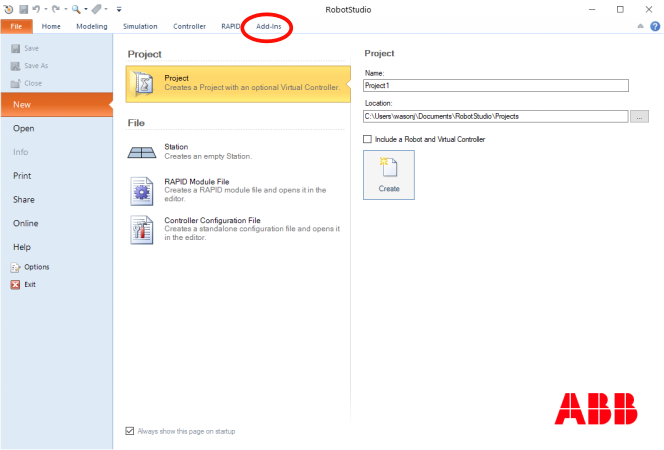
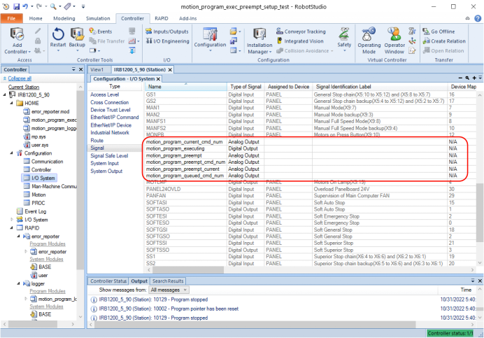
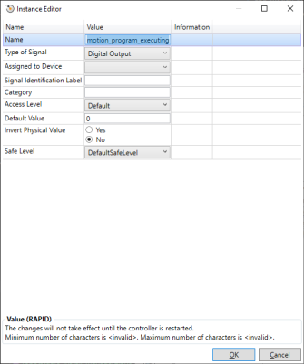

# ABB Motion Program Exec Manual Multi-Move Robot Setup

ABB Multi-Move allows for a single controller to synchronously control up to 4 robots. The ABB
Motion Program Exec software can be used with Multi-Move to control two robots. It can
be modified to control more, but is currently only configured to control two robots. This document
covers setting up a RobotStudio solution to simulate two robots, and install the ABB Motion
Program Exec RAPID software for twe robot operation. This example uses IRB1200 and IRB6640 robots
as examples. These can be substituted for other 6-axis ABB robots.

See robot_setup_manual.md for instructions to set up for single robot use.

## Step 1: Install RobotWare 6.14

**This section only needs to be completed once on RobotWare installation.**

Begin by installing and starting RobotStudio. See 
http://new.abb.com/products/robotics/robotstudio/downloads for downloads.

Once installed, open RobotStudio and click on the "Add-Ins" tab on the top of the window.

First, install the newest version of RobotWare 6.14 for IRC5 controllers. Versions greater 
than RobotWare 6.14 may work, but they have not been tested. In the "RobotApps" -> "Gallery" window,
select RobotWare for IRC5. On the right, select "Version" to be the greatest version of 6.14.
In this example, version 6.14.00.01 is the greatest version available. Click "Add", accept the next
window, and wait for the installation to finish.

RobotStudio is now ready to create a solution.

## 2. Create Solution

Click on the "File" tab, "New", and then "Project". Uncheck "Include a Robot and Virtual Solution". 
Change the project "Name" if desired. Click "Create".

## 3. Add Robots

New we will add two robots to the solution. First, add the IRB 1200. Click "Home" -> "ABB Library"
-> "IRB 1200".

If a window "IRB 1200" appears, select "Standard", "0.9 m", "Standard". The bottom right should show 
"IRB1200_5_90_STD_03". Click "OK".

Right click on "IRB1200_5_90_STD_03" under "Layout", click "Position" -> "Set Position". In the
"Set Position" box in the upper left, type in xyz = (1000,0,500), rpy = (0,0,180). Click "Apply"
to move the robot.

Add another robot, this time an IRB 6640. Click "ABB Library" -> "IRB 6640". Select Version 
"IRB 6640-180" and click "OK".

Right click on "IRB6640_180_255__04" under "Layout", click "Position" -> "Set Position". Set the
position to xyz = (-1500,0,0), rpy = (0,0,0). There should now be two robots in the scene.

## 4. Create Controller

Now we will create a controller configured using Multi-Move to control both robots. Select "Home" 
-> "Virtual Controller" -> "From Layout".

Select defaults, or modify if desired for "Controller Name and Location". Click "Next".

Click "Next" to select both mechanisms.

Use the default Controller Tasks, with Task 1 for the IRB 1200 and Task 2 for the IRB 6640. 
Click "Next"

On the "Controller Options" panel that is now visible, click "Options".

Confirm that "640-1 MultiMove Coordinated" and "623-1 Multitasking" are selected on the right.
If not, search on the top and select them.

Click on "Communication", and select "616-1 PC Interface" and "617-1 FlexPendant Interface".
Click "OK"

**Uncheck "Task Frame(s) aligned with"**. Click "Finish".

RobotStudio will work for a minute or two to complete creation of the controller. Click on
"RAPID", and confirm that the tasks "T_ROB1" and "T_ROB2" were created in the tree on the left.

## 5. Install RAPID Software

Next, copy over the RAPID files to the controller "HOME" directory. For the virtual controller,
right click on "HOME" in the controller tree. (This is the same controller that options were
changed on previously.) Click "Open Folder".

Copy `error_reporter.mod`, `motion_program_exec.mod`,
`motion_program_logger.mod`, and
`motion_program_shared.sys` from `<repo_root>/robot/HOME` to the folder opened by clicking "Open Folder".
The four files should now be visible under "HOME" in the tree view in RobotStudio.

Right click on "Configuration" in the controller tree, and click on "Load Parameters". Browse to 
`<repo_root>/robot/config_params_multimove` and select `SYS.cfg`. Click OK to confirm loading 
parameters,
and OK to acknowledge restart is required. Repeat for `EIO.cfg` in the same directory. Make sure
"Load parameters and replace duplicates" is selected in the file browser window for both. Click
"Controller" -> "Restart (drop down)" -> "Reset RAPID (P-Start)" to restart the controller with 
the new software. Select "OK" to confirm RAPID reset.

The installation should now be complete. The following should match, and can be checked against 
your system to verify installation. Newer versions may add more signals:

## 6. Adjust Robot Base Frame

*This step is optional. Applications can arbitrarily define robot base frames as best suits the
application.*

Robot Studio will by default change the controller base frame to match the location in Robot Studio.
The base frame of the robots are configured on the "Motion" -> "Robot" configuration page. Since we unchecked
"Task frames aligned with:" during controller creation, the robot base origins match their positions during
scene creation:

The base frame values con be adjusted as desired. Robot Studio will attempt to keep these values in sync if
the robots are moved in the scene.

When a robot is moved, **DO NOT UPDATE THE TASK FRAME** when prompted. This will move the origin of the task frame out 
of sync with the origin of the Robot Studio scene, which can be very confusing. The task frame can be directly edited
by clicking "Home" -> "Paths and Targets" -> Right click on "Controller1" in the tree view, and click "Task Frames".
All entries should be zero to keep the task frame aligned with the Robot Studio world frame.

Click "Yes" when prompted to "update controller configuration and restart". This will update the "Motion" -> "Robot"
origins discussed previously.

## 7. Run Programs

The robot is now ready to run programs! The `abb_motion_program_exec_client.py` can be used as a
module to control the robot. For controlling two robots, two motion programs must be created,
one for each robot. They must have exactly the same number of motion commands. The commands
are passed with the `\ID` parameter corresponding to the command number. `SyncMoveOn` is activated
to cause the robots to move in sync if required.

See README.md for the example multi-move program and the `examples` directory.

By default, the virtual controller listens on `http://localhost:80` for requests. The Python
module uses ABB WebServices for communication.

## Updating RAPID modules

To update RAPID modules, copy the updated files to `HOME`, and click Controller -> 
Restart (dropdown)-> Reset RAPID (P-start).