# ABB Motion Program Exec Manual Robot Setup

ABB Motion Program Exec requires software to be installed on the robot. This software can be
installed manually by copying files to the robot controller and importing configuration files.
This documents covers manually installing the software on a virtual controller in Robot Studio.

## Step 1: Install RobotWare 6.14

**This section only needs to be completed once on RobotWare installation.**

Begin by installing and starting RobotStudio. See 
http://new.abb.com/products/robotics/robotstudio/downloads for downloads.

Once installed, open RobotStudio and click on the "Add-Ins" tab on the top of the window.

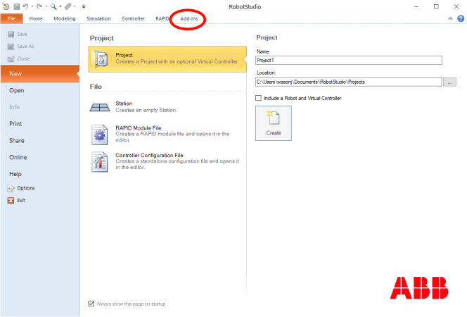

First, install the newest version of RobotWare 6.14 for IRC5 controllers. Versions greater 
than RobotWare 6.14 may work, but they have not been tested. In the "RobotApps" -> "Gallery" window,
select RobotWare for IRC5. On the right, select "Version" to be the greatest version of 6.14.
In this example, version 6.14.00.01 is the greatest version available. Click "Add", accept the next
window, and wait for the installation to finish.

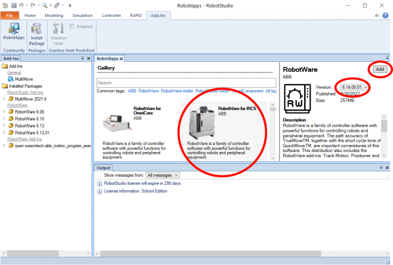

RobotStudio is now ready to create a solution.

## 2. Create Solution and Install Robot

Click on the "File" tab, and then "New". Check "Include a Robot and Virtual Controller". Select the 
RobotWare version installed in Step 1, in this case "6.14.00.01". For this example, the 
"IRB 1200 5kg 0.9m" robot is used. Any 6 or 7 axis single-arm robot can be used instead. Change
the project "Name" if desired. Uncheck "Customize Options".  Click "Create" when ready.

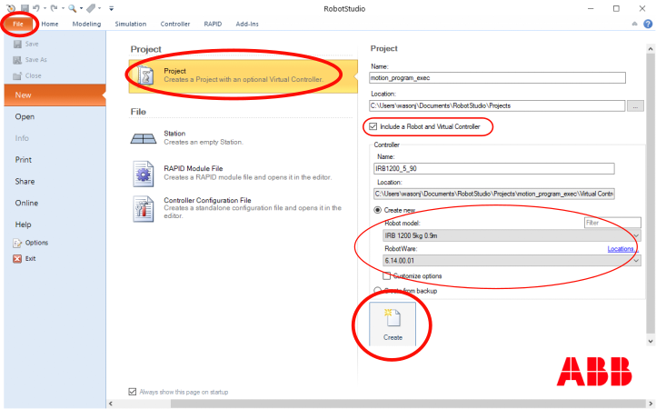

If a window "Select library for '1200.09_5_TypeB (ROB_1)" appears, select "IRB1200_5_90_STD_03" 
and click "OK".

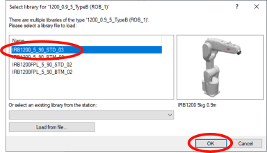

Check which model the "real" robot is if using a robot other than IRB1200. Normally the "STD"
version is fine for simulation. **The variant in terms of reach and payload is very important.** The
other options often don't affect simulation.

Click on the "Controller" tab on the top. Then right click on the virtual control listed in
the left tree view under "Current Station". In this example, the controller is "IRB1200_5_90", but 
it will vary depending on the project configuration. Click "Change Options" on the right-click
popup menu.

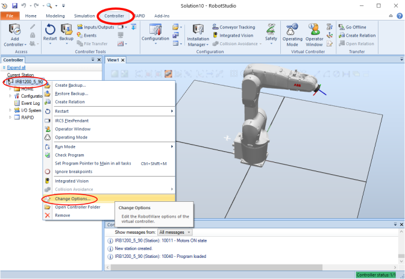

In the "Change Options" window, select "Communication" -> "616-1 PC Interface" and 
"Engineering Tools" -> "623-1 Multitasking". If using EGM, also select "Engineering Tools" -> 
"689-1 Externally Guided Motion".

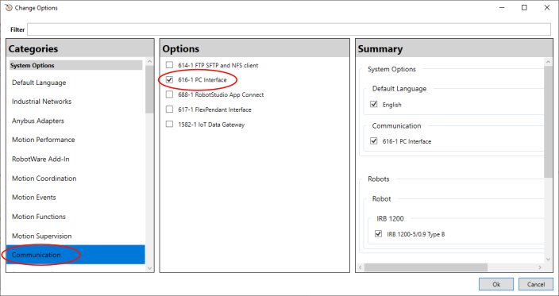

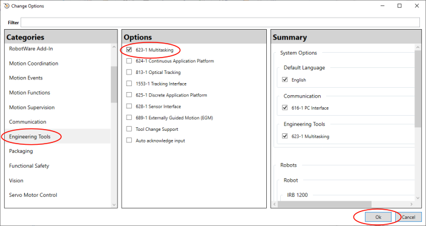

Click OK. Click "Yes" to restart the controller. Click
"OK" to confirm I-start.

Next, copy over the RAPID files to the controller "HOME" directory. For the virtual controller,
right click on "HOME" in the controller tree. (This is the same controller that options were
changed on previously.) Click "Open Folder".

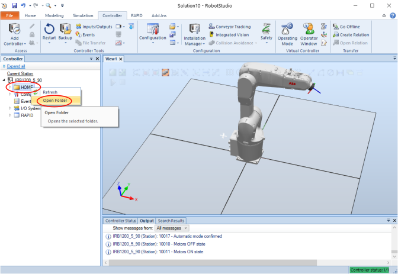

Copy `error_reporter.mod`, `motion_program_exec.mod`, `motion_program_logger.mod`, and
`motion_program_shared.sys` from `<repo_root>/robot/HOME` to the folder opened by clicking "Open Folder". The four
files should now be visible under "HOME" in the tree view in RobotStudio. If using EGM, also copy
`motion_program_exec_egm.mod` to the "HOME" folder.

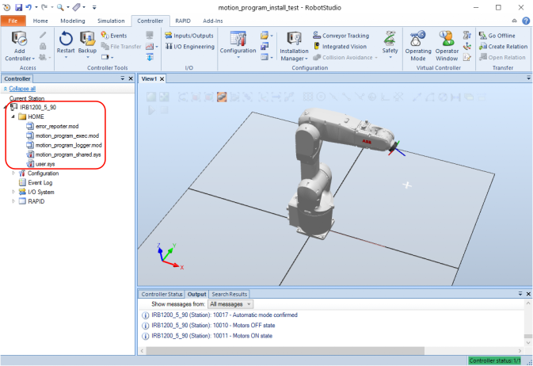

Right click on "Configuration" in the controller tree, and click on "Load Parameters". Browse to 
`<repo_root>/robot/config_params` and select `SYS.cfg`. Click OK to confirm loading parameters,
and OK to acknowledge restart is required. Repeat for `EIO.cfg` in the same directory. Make sure
"Load parameters and replace duplicates" is selected in the file browser window for both. Click
"Controller" -> "Restart (drop down)" -> "Reset RAPID (P-Start)" to restart the controller with 
the new software. Select "OK" to confirm RAPID reset.

If using EGM, use the configuration files from `<repo_root>/robot/config_params_egm`, and load `SYS.cfg`,
`EIO.cfg`, and `MOC.cfg` instead of the files in `config_params`. P-Start once loaded to load the changes. (It is
safe to load these different configuration files after the normal files.)

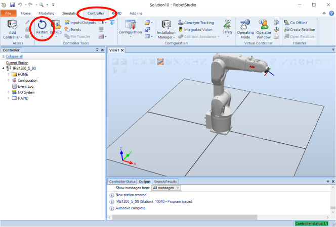

The installation should now be complete. The following should match, and can be checked against 
your system to verify installation (if using EGM, there will be additional files and signals. Newer versions may add 
more signals):

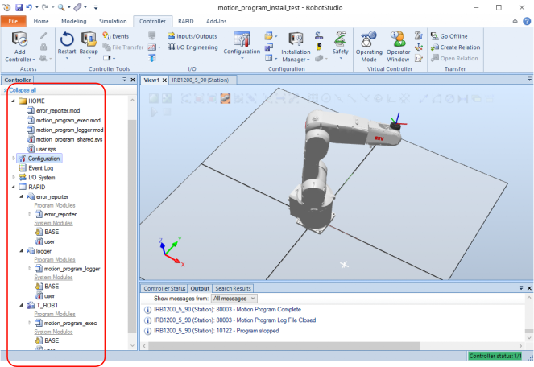


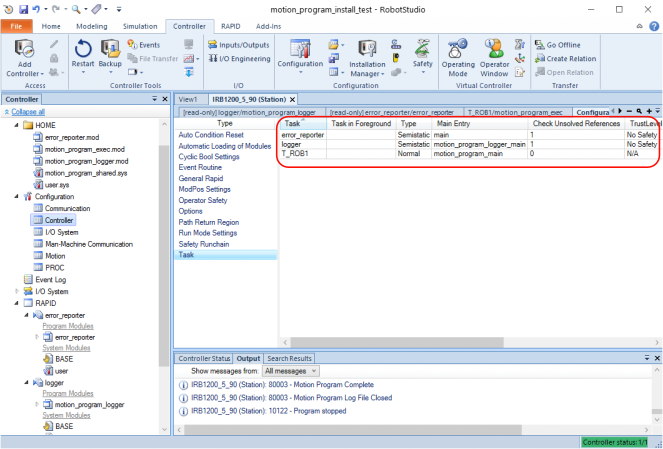

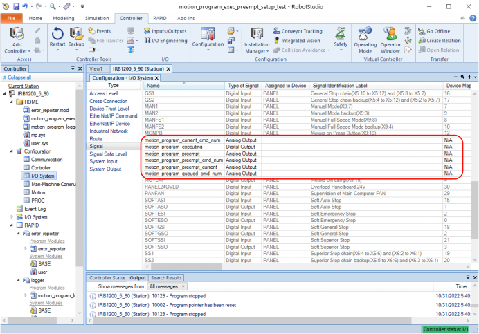

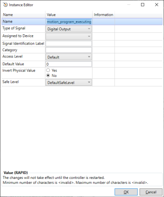

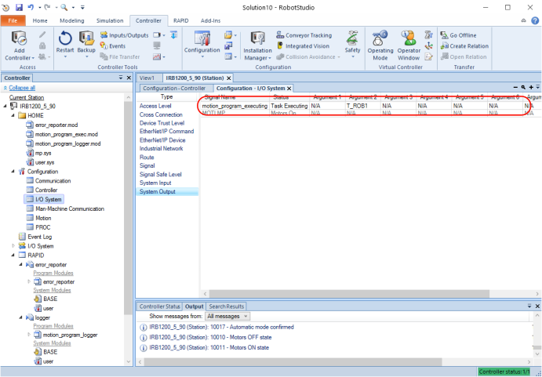

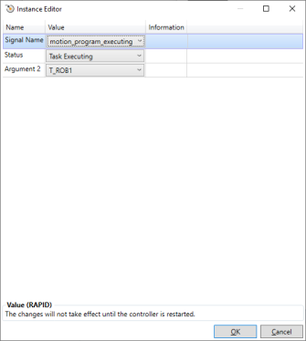

## 3. Run Programs

Install the module using `pip install .`.

The robot is now ready to run programs! The `<repo_root>/examples` directory contains examples to use the scripts.

```
python example.py
```

On Linux, it may be necessary to run `python3`

```
python3 example.py
```

EGM examples can be found in `<repo_root>/examples/egm`.

By default, the virtual controller listens on `http://localhost:80` for requests. The Python
module uses ABB WebServices for communication.

## Updating RAPID modules

To update RAPID modules, copy the updated files to `HOME`, and click Controller -> 
Restart (dropdown)-> Reset RAPID (P-start).
